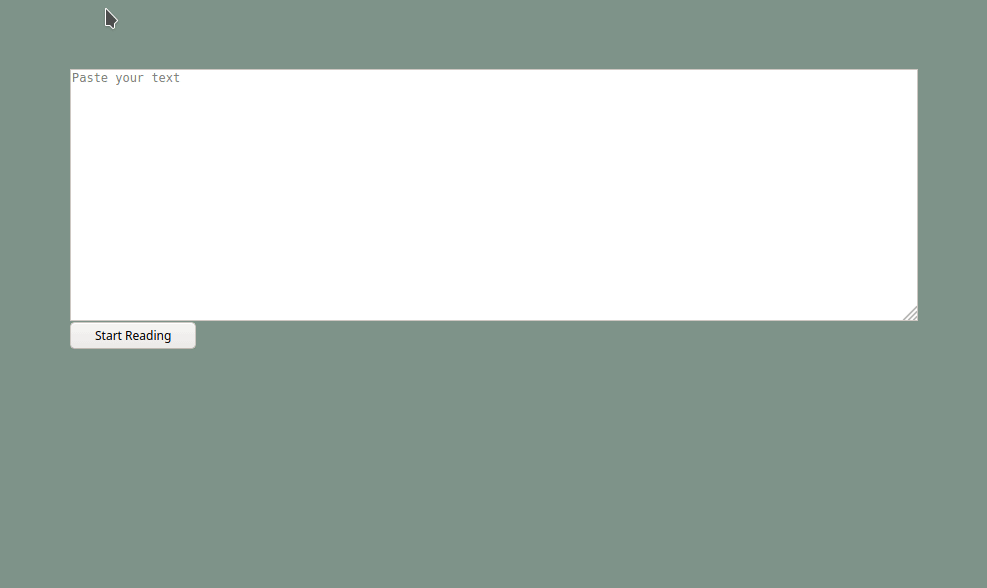

# Better Reading

With this project I try to learn the frontend framework VueJS and at the same time improve my reading speed.
This project is not about an attractive website or a nice design, but only about the functionality and logic of the code.

<br>

# Usage

```
npm install
```

### Compiles and hot-reloads for development

```
npm run serve
```

### Compiles and minifies for production

```
npm run build
```

### Lints and fixes files

```
npm run lint
```

<br>

# Showcase


